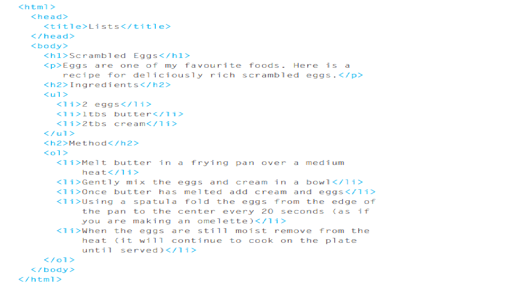

# Ordered Lists
<ol>
The ordered list is created with
the <ol> element

*/ <li>
Each item in the list is placed 
between an opening <li> tag 
and a closing </li> tag. (The li
stands for list item.)
Browsers indent lists by default.
Sometimes you may see a type
attribute used with the <ol>
element to specify the type of 
numbering (numbers, letters, 
roman numerals and so on). It 
is better to use the CSS liststyle-type property covered 
on pages 333-335*/

<ul>
The unordered list is created 
with the <ul> element.
<li>
Each item in the list is placed 
between an opening <li> tag 
and a closing </li> tag. (The li
stands for list item.)
Browsers indent lists by default.
Sometimes you may see a type
attribute used with the <ul>
element to specify the type of 
bullet point (circles, squares, 
diamonds and so on). It is better 
to use the CSS list-styletype property covered on pages 
333-335.

# Example
