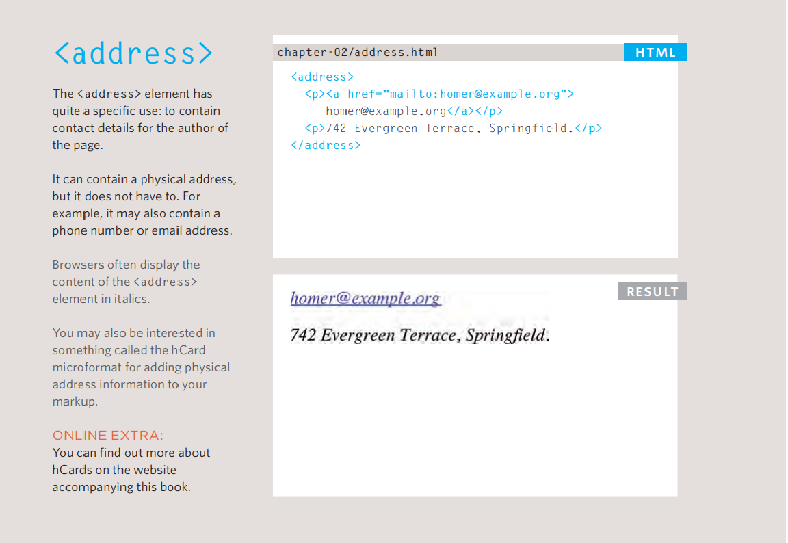

# Headings

HTML has six "levels" of 
headings:
<h1> is used for main headings
<h2> is used for subheadings
If there are further sections 
under the subheadings then the 
<h3> element is used, and so 
on...
Browsers display the contents of 
headings at different sizes. The 
contents of an <h1> element is 
the largest, and the contents of 
an <h6> element is the smallest. 
The exact size at which each 
browser shows the headings 
can vary slightly. Users can also 
adjust the size of text in their 
browser. You will see how to 
control the size of text, its color, 
and the fonts used when we 
come to look at CSS.

# Paragraphs

To create a paragraph, surround 
the words that make up the 
paragraph with an opening 

tag and closing 
 tag.
By default, a browser will show 
each paragraph on a new line 
with some space between it and 
any subsequent paragraphs.

# Bold & Italic
<b>
By enclosing words in the tags 
<b> and </b> we can make 
characters appear bold.
The <b> element also represents 
a section of text that would be 
presented in a visually different 
way (for example key words in a 
paragraph) although the use of 
the <b> element does not imply 
any additional meaning.

# Author Details
